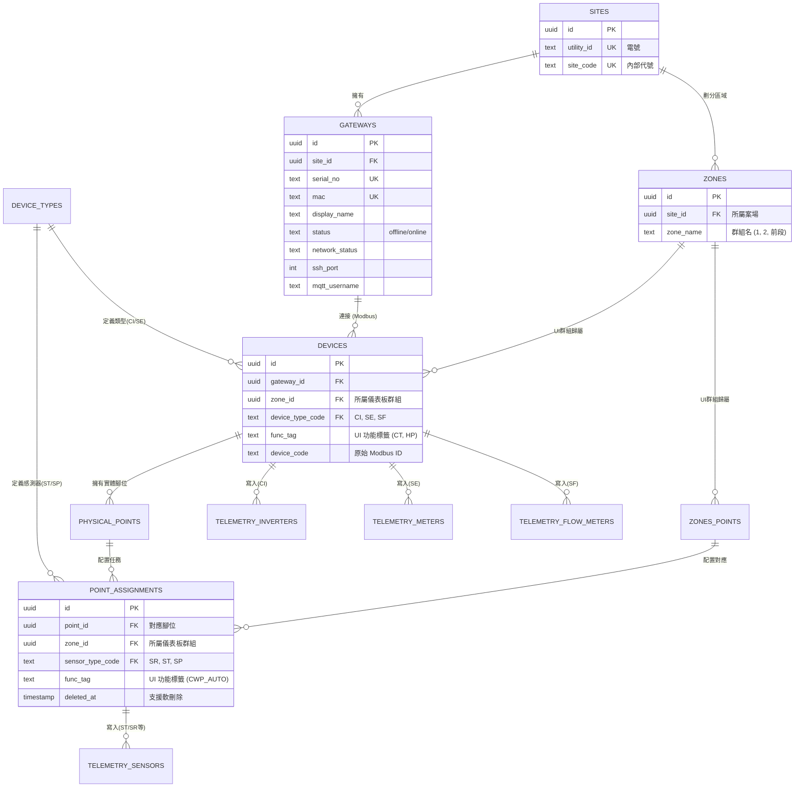

```mermaid
erDiagram
%% 字典表
DEVICE_TYPES ||--o{ DEVICES : "定義類型(CI/SE)"
DEVICE_TYPES ||--o{ POINT_ASSIGNMENTS : "定義感測器(ST/SP)"

    %% 主資料架構 (硬體層級)
    SITES ||--o{ GATEWAYS : "擁有"
    GATEWAYS ||--o{ DEVICES : "連接 (Modbus)"
    DEVICES ||--o{ PHYSICAL_POINTS : "擁有實體腳位"
    PHYSICAL_POINTS ||--o{ POINT_ASSIGNMENTS : "配置任務"

    %% 儀表板與邏輯群組 (UI 呈現層級)
    SITES ||--o{ ZONES : "劃分區域"
    ZONES ||--o{ DEVICES : "UI群組歸屬"
    ZONES ||--o{ ZONES_POINTS : "UI群組歸屬"
    ZONES_POINTS ||--o{ POINT_ASSIGNMENTS : "配置對應"

    %% 時序數據庫 (Telemetry)
    DEVICES ||--o{ TELEMETRY_INVERTERS : "寫入(CI)"
    DEVICES ||--o{ TELEMETRY_METERS : "寫入(SE)"
    DEVICES ||--o{ TELEMETRY_FLOW_METERS : "寫入(SF)"
    POINT_ASSIGNMENTS ||--o{ TELEMETRY_SENSORS : "寫入(ST/SR等)"

    SITES {
        uuid id PK
        text utility_id UK "電號"
        text site_code UK "內部代號"
    }

    ZONES {
        uuid id PK
        uuid site_id FK "所屬案場"
        text zone_name "群組名 (1, 2, 前段)"
    }

    GATEWAYS {
        uuid id PK
        uuid site_id FK
        text serial_no UK
        text mac UK
        text display_name
        text status "offline/online"
        text network_status
        int ssh_port
        text mqtt_username
    }

    DEVICES {
        uuid id PK
        uuid gateway_id FK
        uuid zone_id FK "所屬儀表板群組"
        text device_type_code FK "CI, SE, SF"
        text func_tag "UI 功能標籤 (CT, HP)"
        text device_code "原始 Modbus ID"
    }

    POINT_ASSIGNMENTS {
        uuid id PK
        uuid point_id FK "對應腳位"
        uuid zone_id FK "所屬儀表板群組"
        text sensor_type_code FK "SR, ST, SP"
        text func_tag "UI 功能標籤 (CWP_AUTO)"
        timestamp deleted_at "支援軟刪除"
    }
```
