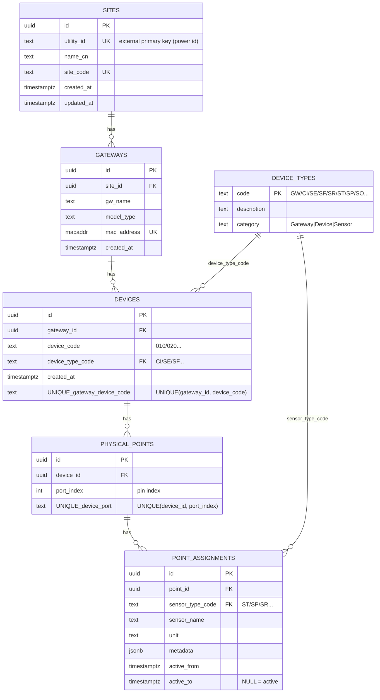

```mermaid
erDiagram
    SITES ||--o{ GATEWAYS : "has"
    GATEWAYS ||--o{ DEVICES : "has"
    DEVICE_TYPES ||--o{ DEVICES : "device_type_code"
    DEVICES ||--o{ PHYSICAL_POINTS : "has"
    PHYSICAL_POINTS ||--o{ POINT_ASSIGNMENTS : "has"
    DEVICE_TYPES ||--o{ POINT_ASSIGNMENTS : "sensor_type_code"

    SITES {
        uuid id PK
        text utility_id UK "external primary key (power id)"
        text name_cn
        text site_code UK
        timestamptz created_at
        timestamptz updated_at
    }

    GATEWAYS {
        uuid id PK
        uuid site_id FK
        text gw_name
        text model_type
        macaddr mac_address UK
        timestamptz created_at
    }

    DEVICES {
        uuid id PK
        uuid gateway_id FK
        text device_code "010/020..."
        text device_type_code FK "CI/SE/SF..."
        timestamptz created_at
        text UNIQUE_gateway_device_code "UNIQUE(gateway_id, device_code)"
    }

    PHYSICAL_POINTS {
        uuid id PK
        uuid device_id FK
        int port_index "pin index"
        text UNIQUE_device_port "UNIQUE(device_id, port_index)"
    }

    POINT_ASSIGNMENTS {
        uuid id PK
        uuid point_id FK
        text sensor_type_code FK "ST/SP/SR..."
        text sensor_name
        text unit
        jsonb metadata
        timestamptz active_from
        timestamptz active_to "NULL = active"
    }

    DEVICE_TYPES {
        text code PK "GW/CI/SE/SF/SR/ST/SP/SO..."
        text description
        text category "Gateway|Device|Sensor"
    }
```