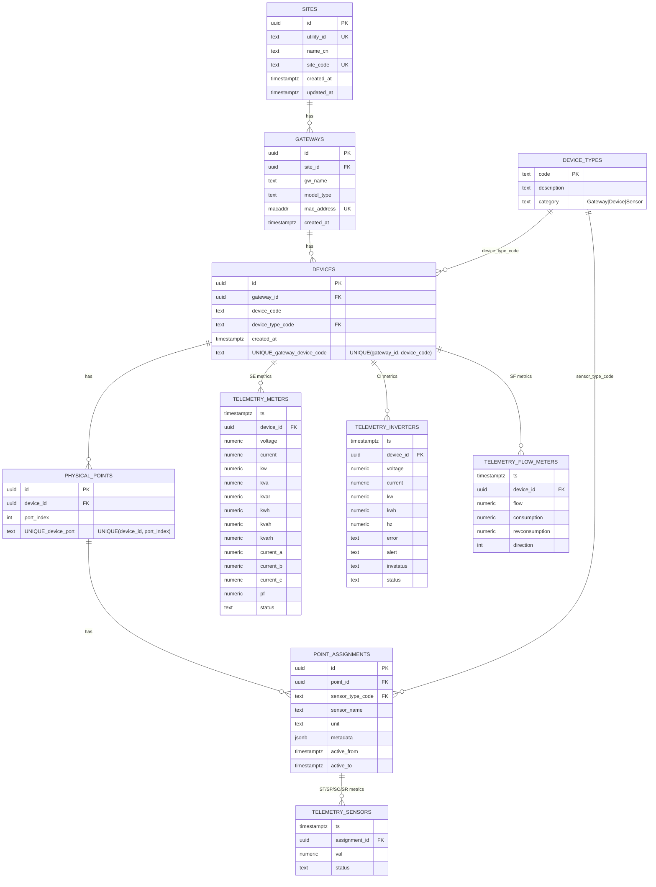

```mermaid
erDiagram
    SITES ||--o{ GATEWAYS : "has"
    GATEWAYS ||--o{ DEVICES : "has"
    DEVICE_TYPES ||--o{ DEVICES : "device_type_code"
    DEVICES ||--o{ PHYSICAL_POINTS : "has"
    PHYSICAL_POINTS ||--o{ POINT_ASSIGNMENTS : "has"
    DEVICE_TYPES ||--o{ POINT_ASSIGNMENTS : "sensor_type_code"

    %% Telemetry tables (Timescale hypertables)
    DEVICES ||--o{ TELEMETRY_METERS : "SE metrics"
    DEVICES ||--o{ TELEMETRY_INVERTERS : "CI metrics"
    DEVICES ||--o{ TELEMETRY_FLOW_METERS : "SF metrics"
    POINT_ASSIGNMENTS ||--o{ TELEMETRY_SENSORS : "ST/SP/SO/SR metrics"

    SITES {
        uuid id PK
        text utility_id UK
        text name_cn
        text site_code UK
        timestamptz created_at
        timestamptz updated_at
    }

    GATEWAYS {
        uuid id PK
        uuid site_id FK
        text gw_name
        text model_type
        macaddr mac_address UK
        timestamptz created_at
    }

    DEVICES {
        uuid id PK
        uuid gateway_id FK
        text device_code
        text device_type_code FK
        timestamptz created_at
        text UNIQUE_gateway_device_code "UNIQUE(gateway_id, device_code)"
    }

    PHYSICAL_POINTS {
        uuid id PK
        uuid device_id FK
        int port_index
        text UNIQUE_device_port "UNIQUE(device_id, port_index)"
    }

    POINT_ASSIGNMENTS {
        uuid id PK
        uuid point_id FK
        text sensor_type_code FK
        text sensor_name
        text unit
        jsonb metadata
        timestamptz active_from
        timestamptz active_to
    }

    DEVICE_TYPES {
        text code PK
        text description
        text category "Gateway|Device|Sensor"
    }

    TELEMETRY_METERS {
        timestamptz ts
        uuid device_id FK
        numeric voltage
        numeric current
        numeric kw
        numeric kva
        numeric kvar
        numeric kwh
        numeric kvah
        numeric kvarh
        numeric current_a
        numeric current_b
        numeric current_c
        numeric pf
        text status
    }

    TELEMETRY_INVERTERS {
        timestamptz ts
        uuid device_id FK
        numeric voltage
        numeric current
        numeric kw
        numeric kwh
        numeric hz
        text error
        text alert
        text invstatus
        text status
    }

    TELEMETRY_FLOW_METERS {
        timestamptz ts
        uuid device_id FK
        numeric flow
        numeric consumption
        numeric revconsumption
        int direction
    }

    TELEMETRY_SENSORS {
        timestamptz ts
        uuid assignment_id FK
        numeric val
        text status
    }
```